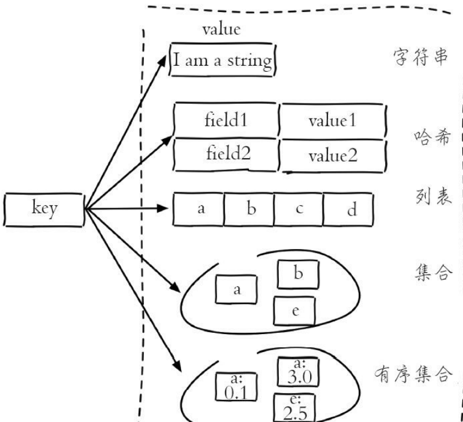
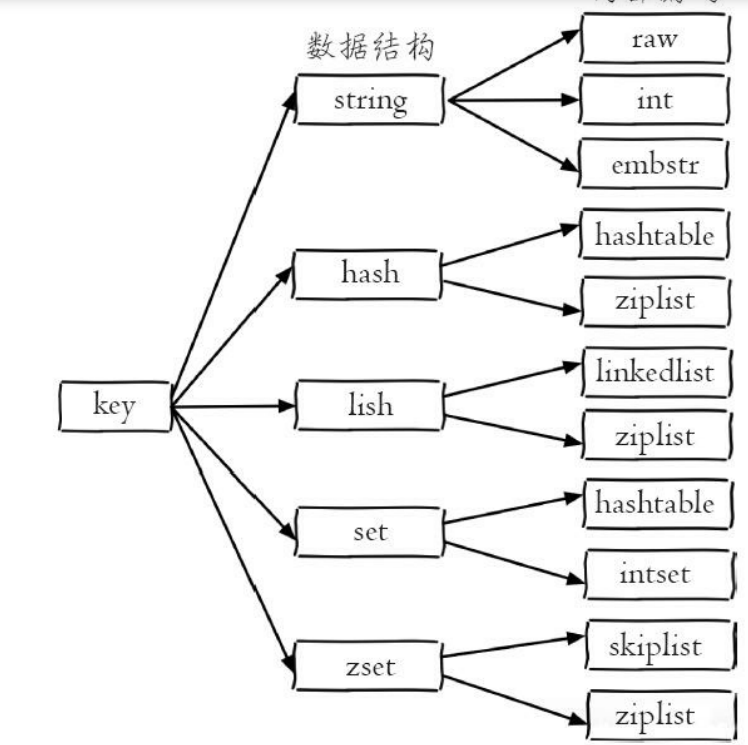
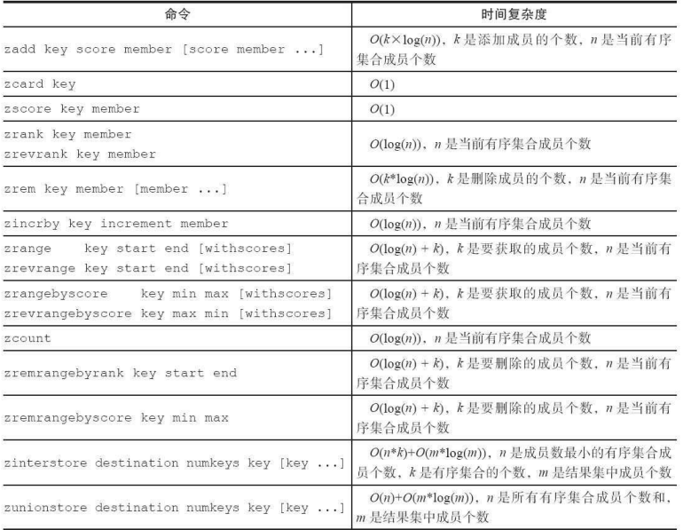
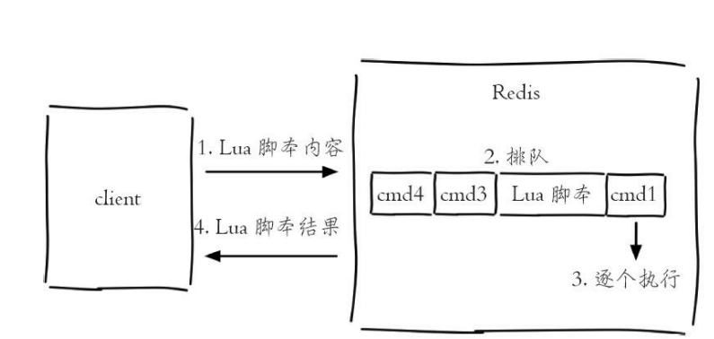
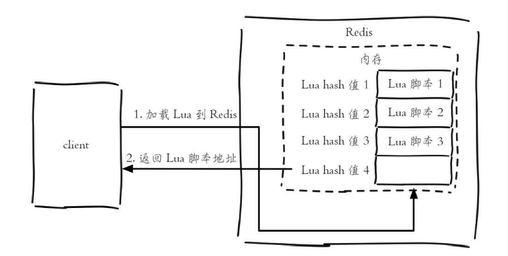
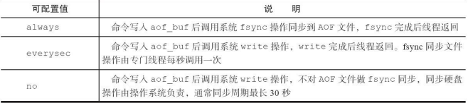

#  Redis

## 1.安装与启动

```
命令：
docker run -p 6379:6379 --name redis -v /docker/redis/redis.conf:/etc/redis/redis.conf -v /docker/redis/data:/data -d redis redis-server /etc/redis/redis.conf 

```

```
命令解析：
docker run redis # 从redis镜像运行容器
-p 6379:6379 # 映射本地6379端口到容器6379端口，前为本地端口
--name redis # 设置容器名称为redis，方便以后使用docker ps进行管理
-v /docker/redis/redis.conf:/etc/redis/redis.conf # 关联本地/docker/redis/redis.conf文件到容器中/etc/redis/redis.conf，同样，前为本地
-v /docker/redis/data:/data # 关联本地/docker/redis/data到容器内/data目录，此为存放redis数据的目录，为方便以后升级redis，而数据可以留存
-d # 后台启动，使用此方式启动，则redis.conf中daemonize必须设置为no，否则会无法启动
redis-server /etc/redis/redis.conf # 在容器内启动redis-server的命令，主要是为了加载配置

```

```
配置文件：
# Redis配置文件

# Redis默认不是以守护进程的方式运行，可以通过该配置项修改，使用yes启用守护进程
daemonize no

# 指定Redis监听端口，默认端口为6379
port 6379

# 绑定的主机地址，不要绑定容器的本地127.0.0.1地址，因为这样就无法在容器外部访问
bind 0.0.0.0

#需要密码则打开
requirepass mima

# 持久化
appendonly yes

```

```
启动：

/docker/redis/redis.bash
# 查看是否已启动
docker ps
# 如果无法启动或者docker ps中无对应内容，将bash中命令复制出来，删除-d参数启动，查看报错信息
# 使用redis-cli或者rdm访问 localhost:6379
# 如需访问容器，可使用
docker exec -it redis bash
# 或直接使用redis-cli访问容器内redis
docker exec -it redis redis-cli [-a mima] [-h 端口默认 127.0.0.0] [-p 默认6379]

停止：
docker exec -it redis redis-cli shutdown
```

## 2.API的理解与使用

### 2.1 前置知识

#### 2.1.1 全局命令

1.查看所有键 keys *

2.设置字符串的键 set hello world

3.设置列表是键 rpush mylist a b c d e f

4.键总数 dbsize 注：该命令直接获取内置的键总数变量，时间复杂度是O(1),keys命令会遍历所有键，时间复杂度是O(n)

5.检查键是否存在：exists key

6.删除键：del a b c

7.键过期：expire key seconds，ttl命令会返回键的剩余过期时间

#### 2.1.2 数据结构与内部编码

1.五种数据结构



2.内部编码结构



3.优势

   (1) 可以改进内部编码，而对外的数据 结构和命令没有影响，这样一旦开发出更优秀的内部编码，无需改动外部数 据结构和命令

（2）多种内部编码实现可以在不同场景下发挥各自的优势


### 2.2 字符串

#### 2.2.1 命令


```
1.设置值
set key value [ex seconds] [px milliseconds] [nx|xx]
set命令有几个选项：
·ex seconds：为键设置秒级过期时间。
·px milliseconds：为键设置毫秒级过期时间。
·nx：键必须不存在，才可以设置成功，用于添加。
·xx：与nx相反，键必须存在，才可以设置成功，用于更新。


2.值是否存在
 exists hello
 
3.获取值
get hello

4.批量设置值
mset a 1 b 2 c 3 d 4

5.批量获取
 mget a b c f
 
 批操作可以提高开发效率，单次命令需要n次网络传输操作与执行命令，批处理单次网络，多次执行命令时间
 
 6.incr自增命令，Redis提供了decr（自减）、incrby（自增指定数字）、
decrby（自减指定数字）、incrbyfloat（自增浮点数）

7.在字符串后拼接字符串
append key world

8.字符串长度
strlen key

9.设置并返回原值
127.0.0.1:6379> getset hello world
(nil)
127.0.0.1:6379> getset hello redis
"world"

10.设置指定位置的字符，修改
setrange key offeset value

11.获取指定范围字符串
getrange key start end 左闭右闭


```

### 2.2 哈希

#### 2.2.1 命令

```
1.设置值
 hset user:1 name tom
 hset key field value
 注：user:1是key   name为key对应的哈希数据的key此处称为field  tome为value  name与key称为哈希的值,理解为key为组别，field value为组中记录所包含性质
 
2.获取值
hget key field
hget user:1 name

3.删除filed
hdel key field [field ...]

4.计算field个数
hlen key

5.批量设置或获取
hmget key field [field ...]
hmget user:1 name city

hmset key field value [field value ...]
hmset user:1 name mike age 12 city tianji

6.field是否存在
hexists key field

8.获取所有field
hkeys key

9.获取所有values
hvals values

10.获取所有field-value
hgetall key

11.hincrby hincrbyfloat
作用域为field
hincrby key field

12.计算value的字符串长度
hstrlen key field
```

#### 2.2.2  内部编码

·ziplist（压缩列表）：当哈希类型元素个数小于hash-max-ziplist-entries 配置（默认512个）、同时所有值都小于hash-max-ziplist-value配置（默认64 字节）时，Redis会使用ziplist作为哈希的内部实现，ziplist使用更加紧凑的 结构实现多个元素的连续存储，所以在节省内存方面比hashtable更加优秀。

·hashtable（哈希表）：当哈希类型无法满足ziplist的条件时，Redis会使 用hashtable作为哈希的内部实现，因为此时ziplist的读写效率会下降，而 hashtable的读写时间复杂度为O（1）

查看编码类型命令： object encoding hashkey

### 2.3 列表

#### 2.3.1 命令

```
1.添加操作
rpush key value [value ...]

2.左边插入元素
lpush key value [value ...]

3.向某个元素前或者后插入元素
linsert key before|after pivot value

linsert命令会从列表中找到等于pivot的元素，在其前（before）或者后
（after）插入一个新的元素value

linsert listkey before b java

4.范围查找
lrange key start end
获取范围内所有元素 左闭右闭

5.索引查找
lindex key index

6.获取列表长度
llen key

7.列表最左侧弹出
lpop key

8.最右侧弹出
rpop key

9.删除等于指定元素值的元素
lrem key count value
count>0 从左往右查找
count<0 从右往左查找
count=0 删除所有

10.只保留指定范围内元素
ltrim key start end

11.修改指定下标
lset key index newValue

12.阻塞弹出
blpop key [key ...] timeout 从右往左
brpop key [key ...] timeout 从左往右

key[key...]：多个列表的键。
timeout：阻塞时间

1）列表为空：如果timeout=3，那么客户端要等到3秒后返回，如果
timeout=0，那么客户端一直阻塞等下去：如果此期间添加了数据element1，客户端立即返回
2）列表不为空：客户端会立即返回

第一点，如果是多个键，那么brpop会从左至右遍历键，一旦有一个键能弹出元素，客户端立即返回
第二点，如果多个客户端对同一个键执行brpop，那么最先执行brpop命
令的客户端可以获取到弹出的值


```

#### 2.3.2 内部编码

·linkedlist（链表）：当列表类型无法满足ziplist的条件时，Redis会使用 linkedlist作为列表的内部实现

当元素个数超过512个，或者当某个元素超过64字节，内部编码由ziplist变为linkedlist

#### 2.3.3 使用实例

·lpush+lpop=Stack（栈）

 ·lpush+rpop=Queue（队列） 

·lpsh+ltrim=Capped Collection（有限集合） 

·lpush+brpop=Message Queue（消息队列）

### 2.4 集合

#### 2.3.1 命令

```
1.添加元素
sadd key element [element ...]

2.删除元素
srem key element [element ...]

3.元素个数
scard key
存在内部变量记录，时间复杂度O(1)

4.判断元素是否在集合中
sismember key element

5.随机从集合返回指定个数元素
srandmember key [count]

6.从集合随机弹出元素
spop key

7.获取所有元素
smembers key

8.求多个集合的交集
sinter key [key ...]

9.求多个集合的并集
suinon key [key ...]

10.求多个集合的差集
sdiff key [key ...]

11.将交集、并集、差集的结果保存
sinterstore destination key [key ...]
suionstore destination key [key ...]
sdiffstore destination key [key ...]
destination 存储结果的集合
```

#### 2.3.2 内部编码

intset（整数集合）：当集合中的元素都是整数且元素个数小于set-maxintset-entries配置（默认512个）时，Redis会选用intset来作为集合的内部实 现，从而减少内存的使用。

 ·hashtable（哈希表）：当集合类型无法满足intset的条件时，Redis会使 用hashtable作为集合的内部实现。

#### 2.3.3 使用实例

·sadd=Tagging（标签）

·spop/srandmember=Random item（生成随机数，比如抽奖） 

·sadd+sinter=Social Graph（社交需求）

### 2.5 有序集合

#### 2.5.1 特性

​	1.不能重复成员

​	2.不使用下标，给元素设置分数作为排序的依据

​	3.元素不可以重复，但是分数可以重复

#### 2.5.2 命令

```
1.添加成员
zadd key score member [score member ...]
zadd user:ranking 251 tom

一个key包含多个成员
同时具有：
·nx：member必须不存在，才可以设置成功，用于添加。
·xx：member必须存在，才可以设置成功，用于更新。
·ch：返回此次操作后，有序集合元素和分数发生变化的个数
·incr：对score做增加，相当于后面介绍的zincrby

2.计算成员个数
zcard key

3.计算某个成员的分数
zscore key member
zscore user:ranking tom

4.计算成员的排名
zrank key member 从低到高
zrevrank key member	从高到低

5.将成员从有序集合中删除
zrem key member [member ...]

6.增加成员的分数
zincrby key increment member

7.返回指定排名范围的成员，end支持-1
zrange key start end [withscores]
zrevrange key start end [withscores]

8.返回指定分数范围的成员
zrangebyscore key min max [withscores] [limit offset count]
zrevrangebyscore key max min [withscores] [limit offset count]

9.返回指定分数范围成员个数
zcount key min max

10.删除指定排名内的升序元素
zremrangebyrank key start end

11.删除指定范围的成员
zremrangebyrank key start end

下面操作将250分以上的成员全部删除，返回结果为成功删除的个数：
 zremrangebyscore user:ranking (250 +inf
 -inf 与 +inf分别表示无穷大与无穷小
```

#### 2.5.3 集合间操作命令

```
测试用例
zadd user:ranking:1 1 kris 91 mike 200 frank 220 tim 250 martin 251 tom
zadd user:ranking:2 8 james 77 mike 625 martin 888 tom

1.交集
zinterstore destination numkeys key [key ...] [weights weight [weight ...]]
[aggregate sum|min|max]

·destination：交集计算结果保存到这个键。

·numkeys：需要做交集计算键的个数。

·key[key...]：需要做交集计算的键。

·weights weight[weight...]：每个键的权重，在做交集计算时，每个键中的每个member会将自己分数乘以这个权重，每个键的权重默认是1。

·aggregate sum|min|max：计算成员交集后，分值可以按照sum（和）、
min（最小值）、max（最大值）做汇总，默认值是sum。

例如：
zinterstore user:ranking:1_inter_2 2 user:ranking:1 user:ranking:2 weights 1 0.5 aggregate max
设置权重1 0.5 ，对应分数取最大，集合计算键的个数为2

2.并集
zunionstore destination numkeys key [key ...] [weights weight [weight ...]]
[aggregate sum|min|max]

```



#### 2.5.4 内部编码

·ziplist（压缩列表）：当有序集合的元素个数小于zset-max-ziplist-entries配置（默认128个），同时每个元素的值都小于zset-max-ziplist-value配 置（默认64字节）时，Redis会用ziplist来作为有序集合的内部实现，ziplist 可以有效减少内存的使用。

 ·skiplist（跳跃表）：当ziplist条件不满足时，有序集合会使用skiplist作 为内部实现，因为此时ziplist的读写效率会下降。

#### 2.5.5 使用实例

有序集合比较典型的使用场景就是排行榜系统

### 2.6 键管理

#### 2.6.1 命令

```
1.键重命名
rename key newkey 强行重命名，存在也覆盖
renamenx 不存在时更新，反之返回0，表示失败

注:重命名会删除旧键，如果值太大，会造成堵塞

2.查看键数量，随机返回一个
dbsize
randomkey

3.键过期
·expire key seconds：键在seconds秒后过期
·expireat key timestamp：键在秒级时间戳timestamp后过期
·ttl 查看过期剩余时间
·pttl 查看毫秒级别的过期时间
·pexpire key milliseconds：键在milliseconds毫秒后过期。
·pexpireat key milliseconds-timestamp键在毫秒级时间戳timestamp后过期
·persist命令可以将键的过期时间清除

注：
1.对于字符串类型键，执行set命令会去掉过期时间，这个问题很容易在开发中被忽视
2.Redis不支持二级数据结构（例如哈希、列表）内部元素的过期功能，例如不能对列表类型的一个元素做过期时间设置
3.setex命令作为set+expire的组合，不但是原子执行，同时减少了一次网络通讯的时间

4.全量遍历键
keys pattern,后接正则表达式
·*代表匹配任意字符。
·代表匹配一个字符。
·[]代表匹配部分字符，例如[1，3]代表匹配1，3，[1-10]代表匹配1到10
的任意数字。
·\x用来做转义，例如要匹配星号、问号需要进行转义。
注：键值大时，容易阻塞

5.渐进式遍历
scan采用渐进式遍历的方式来解决keys命令可能带来的阻塞问题
scan cursor [match pattern] [count number]

·cursor是必需参数，实际上cursor是一个游标，第一次遍历从0开始，每
次scan遍历完都会返回当前游标的值，直到游标值为0，表示遍历结束。
·match pattern是可选参数，它的作用的是做模式的匹配，这点和keys的
模式匹配很像。
·count number是可选参数，它的作用是表明每次要遍历的键个数，默认
值是10，此参数可以适当增大。

返回值 下次执行的cursor,第二部分返回键
```

### 2.7 数据库管理

与关系型数据库用字符来区分不同数据库名不同，Redis只是用数 字作为多个数据库的实现，默认配置16个数据库

#### 2.7.1 命令

```
1.切换数据库
select dbIndex

2.清除数据库
flushdb/flushall命令用于清除数据库
两者的区别的是flushdb只清除当前数据库，flushall会清除所有数据库
```

### 2.8 总结

1）Redis提供5种数据结构，每种数据结构都有多种内部编码实现。 

2）纯内存存储、IO多路复用技术、单线程架构是造就Redis高性能的三 个因素。 

3）由于Redis的单线程架构，所以需要每个命令能被快速执行完，否则 会存在阻塞Redis的可能，理解Redis单线程命令处理机制是开发和运维Redis 的核心之一。 

4）批量操作（例如mget、mset、hmset等）能够有效提高命令执行的效 率，但要注意每次批量操作的个数和字节数。 

5）了解每个命令的时间复杂度在开发中至关重要，例如在使用keys、 hgetall、smembers、zrange等时间复杂度较高的命令时，需要考虑数据规模 对于Redis的影响。 

6）persist命令可以删除任意类型键的过期时间，但是set命令也会删除 字符串类型键的过期时间，这在开发时容易被忽视。 

7）move、dump+restore、migrate是Redis发展过程中三种迁移键的方 式，其中move命令基本废弃，migrate命令用原子性的方式实现了 dump+restore，并且支持批量操作，是Redis Cluster实现水平扩容的重要工 具。 

8）scan命令可以解决keys命令可能带来的阻塞问题，同时Redis还提供hscan、sscan、zscan渐进式地遍历hash、set、zset。


## 3.功能

### 3.1 慢查询分析

慢查询日志就是系统在命令执行前后计算每条命 令的执行时间，当超过预设阀值，就将这条命令的相关信息（例如：发生时 间，耗时，命令的详细信息）记录下来

#### 3.1.1 命令生命周期

1.发送命令

2.命令排队

3.命令执行，慢查询只记录该过程，其他步骤超时不记录

4.结果返回

#### 3.1.2 慢查询的两个配置参数

slowlog-log-slower-than：预设阈值，单位微秒，默认1000，为0记录所有，小于0，所有都不记录

slowlog-max-len：最多存放条数，使用一个列表存放日志

#### 3.1.3 修改变量参数

config set slowlog-log-slower-than 20000 

config set slowlog-max-len 1000

使用config rewrite可以持久化配置

#### 3.1.4 慢查询日志命令

```
1.获取日志
slowlog get [n]：n指定条数

2.获取长度
slowlog len

3.重置
slowlog reset
```

#### 3.1.5 使用注意

·slowlog-max-len配置建议：线上建议调大慢查询列表，记录慢查询时 Redis会对长命令做截断操作，并不会占用大量内存。增大慢查询列表可以减缓慢查询被剔除的可能，例如线上可设置为1000以上。 

·slowlog-log-slower-than配置建议：默认值超过10毫秒判定为慢查询， 需要根据Redis并发量调整该值。由于Redis采用单线程响应命令，对于高流 量的场景，如果命令执行时间在1毫秒以上，那么Redis最多可支撑OPS不到 1000。因此对于高OPS场景的Redis建议设置为1毫秒。 

·慢查询只记录命令执行时间，并不包括命令排队和网络传输时间。因 此客户端执行命令的时间会大于命令实际执行时间。因为命令执行排队机 制，慢查询会导致其他命令级联阻塞，因此当客户端出现请求超时，需要检 查该时间点是否有对应的慢查询，从而分析出是否为慢查询导致的命令级联 阻塞。

 ·由于慢查询日志是一个先进先出的队列，也就是说如果慢查询比较多 的情况下，可能会丢失部分慢查询命令，为了防止这种情况发生，可以定期 执行slow get命令将慢查询日志持久化到其他存储中（例如MySQL），然后 可以制作可视化界面进行查询

### 3.2 Redis Shell

#### 3.2.1 redis-cli

```
1. -r
-r（repeat）选项代表将命令执行多次

2.-i
-i（interval）选项代表每隔几秒执行一次命令,单位为秒，但是-i选项必须和-r选项一起使用

3.-x
-x选项代表从标准输入（stdin）读取数据作为redis-cli的最后一个参
数，例如下面的操作会将字符串world作为set hello的值

echo "world" | redis-cli -x set hello

4.-c
用于连接redis cluster节点

5.-a
如果Redis配置了密码，可以用-a（auth）选项，有了这个选项就不需要
手动输入auth命令

6.--scan和--pattern
--scan选项和--pattern选项用于扫描指定模式的键，相当于使用scan

7.--slave
会将当前客户端模拟为当前节点的从节点，当对当前节点作修改时，该客户端会得到更新操作日志

8.--rdb
--rdb选项会请求Redis实例生成并发送RDB持久化文件，保存在本地,可使用它做持久化文件的定期备份

9.--pipe
--pipe选项用于将命令封装成Redis通信协议定义的数据格式，将多条命令批量发送给Redis执行

10.--bigkeys
使用scan命令对Redis的键进行采样，从中找到内存占用比较大的键值，这些键可能是系统的瓶颈

11.--eval
用于执行lua脚本

12.--latency

```

#### 3.2.2 redis-server

主要启动redis服务

```
--test-memory
检测当前系统是否可以分配指定的内存给redis服务

是否足够1G，redis-server --test-memory 1024
```

#### 3.2.3 redis-banchmark

提供选项帮助测试Redis相关性能

1.-c

代表客户端的并发数量


2.-n<requests>

代表客户端请求总量

eg:redis-banchmark -c 100 -n 20000

模拟100个客户端请求执行20000次，进行测试，返回性能指标


3.-q

显示redis-banchmark的requests per second


4.-t

-t选项可以对指定命令进行基准测试

redis-benchmark -t get,set -q 

SET: 98619.32 requests per second 

GET: 97560.98 requests per second


5.--csv

--csv选项会将结果按照csv格式输出

redis-benchmark -t get,set --csv

 "SET","81300.81" 

"GET","79051.38"

### 3.3 Pipeline

#### 3.3.1 Pipeline概念

执行命令过程：1.发送命令，2.命令排队,3.命令执行,4.返回结果

1+4两步称为RTT 往返时间


存在问题：批操作命令节约RTT，但是大部分不支持批处理命令

pipeline机制：将一组redis命令组装，一次性传输给redis,返回一组的命令的结果


### 3.4 事务与Lua

为了保证多条命令组合的原子性，Redis提供了简单的事务功能以及集 成Lua脚本来解决这个问题

#### 3.4.1 事务

Redis提供了简单的事务功能，将一组需要一起执行的命令放到multi和 exec两个命令之间。multi命令代表事务开始，exec命令代表事务结束，即要么全部执行要么不执行，它们 之间的命令是原子顺序执行的

```
127.0.0.1:6379> multi
OK
127.0.0.1:6379> sadd user:a:follow user:b
QUEUED
127.0.0.1:6379> sadd user:b:fans user:a
QUEUED
此时表述动作被保存，在发现exec后一起执行，discard可以停止事务
```

redis不支持回滚

#### 3.4.2 Lua用法简介

##### 3.4.2.1.数据类型与逻辑处理

```lua
定义字符串
local strings val = "world"
local 表示局部变量
```

```lua
数组，使用tables，下标从1开始计算
local tables myArray = {"redis", "jedis", true, 88.0}
```

```lua
for循环
1.
local int sum = 0
for i = 1, 100
do
	sum = sum + i
end
-- 输出结果为5050
print(sum)

2.在数组前加#表示长度
for i = 1, #myArray
do
	print(myArray[i])
end

3.提供ipairs
for index,value in ipairs(myArray)
do
print(index)
print(value)
end

```

```lua
while循环
local int sum = 0
local int i = 0
while i <= 100
do
	sum = sum +i
	i = i + 1
end
--输出结果为5050
print(sum)
```

```lua
if else
 
local tables myArray = {"redis", "jedis", true, 88.0}
for i = 1, #myArray
do
	if myArray[i] == "jedis"
	then
		print("true")
		break
	else
		--do nothing
	end
end

```

```lua
哈希
local tables user_1 = {age = 28, name = "tome"}
--user_1 age is 28
print("user_1 age is " .. user_1["age"])
```


##### 3.4.2.2 函数定义

在Lua中，函数以function开头，以end结尾，funcName是函数名，中间部 分是函数体

```
function funcName()
...
end
contact函数将两个字符串拼接：
function contact(str1, str2)
return str1 .. str2
end
--"hello world"
print(contact("hello ", "world"))

```

#### 3.4.3 redis与Lua

##### 3.4.3.1  在redis中使用Lua：eval与evalsha

eval命令和--eval参数本质是一样的，客户端如果想执行Lua脚本，首先 在客户端编写好Lua脚本代码，然后把脚本作为字符串发送给服务端，服务 端会将执行结果返回给客户端

```lua
1.eval
eval 脚本内容 key个数 key列表 参数列表
也可使用redis-cli--eval直接执行文件

eg:
eval 'return "hello " .. KEYS[1] .. ARGV[1]' 1 redis world

1表示个数用于指定后多少位为key列表，其他的为参数列表，不存在key个数则全是key列表，没有参数列表,下标从1开始
```

执行流程：



```lua
evalsha:将脚本发生到服务端得到服务端保存该脚本的哈希值，以后复用直接调用哈希值

#redis-cli script load "$(cat lua_get.lua)"
"7413dc2440db1fea7c0a0bde841fa68eefaf149c"

执行方式与eval一致
evalsha 脚本SHA1值 key个数 key列表 参数列表

```



##### 3.4.3.1 lua的redis api

```
redis.call("set", "hello", "world")
redis.call("get", "hello")
127.0.0.1:6379> eval 'return redis.call("get", KEYS[1])' 1 hello

```

### 3.5 Bitmaps

#### 3.5.1 数据结构模型

1.bitmaps本身不是一种数据结构，实际为字符串，但是可以对字符串的位进行操作

2.把bitmaps定义为以位为单位的数据，数据的每个单元只能存储0与1，下标称为偏移量，例如将偏移量设置为用户id时，通过变换0,1可用于记录用户是否访问

#### 3.5.2 命令

```
1.设置值,设置键的第offset个位的值
setbit key offset value

2.获取值,获取第offset位的值,不存在也返回0
gitbit key offset

3.获取bitmaps指定范围
bitcount [start] [end]

4.btmaps间的运算
bitop op destkey key[key...]
op可以等于or,and,not,xor(异或),对多个bitmaps(key)进行操作存于destkey

5.计算bitmaps中第一个值为targeBit的偏移量
bitpos key targetBit [start] [end]
```

#### 3.5.3 作用

在存储用户ID时，使用set需要六十四位，bitmaps只需要一位，但是在大量非活跃用户时，set更优，反之亦然

### 3.6 HyperLogLog

HyperLogLog并不是一种新的数据结构（实际类型为字符串类型），而是一种基数算法，通过HyperLogLog可以利用极小的内存空间完成独立总数 的统计，数据集可以是IP、Email、ID

#### 3.6.1 命令

```
1.添加,成功则返回1
pfadd key element [element]
2.计算独立用户数,计算key中的数据个数
pfcount key [key]
3.合并
pfmerge destkey sourcekey [sourcekey...]
求出多个sourcekey的并集存入destkey
```

#### 3.6.2 总结

1.内存占用量非常小，但是存在错误率

2.只为了计算独立总数，不需要获取单条数据

3.可以容忍一定误差率，内存占用量优势巨大

### 3.7 发布订阅

redis提供基于“发布/订阅”模式的消息机制，发布者与订阅者不进行直接通信，发布者向指定频道发生消息，订阅该频道的所有客户端都可以接收该消息

#### 3.7.1 命令

```
1.发布消息,返回值为订阅者个数
publish channel message

2.订阅消息，可订阅多个频道，新开启的订阅客户端，无法接收该频道之前的消息，不会对发布消息进行持久化
subscribe channel [channel]

3.取消订阅
unsubscrib [channel]

4.按照模式进行订阅和取消订阅
psubscribe pattern pattern
punsubscribe pattern

eg:使用正则匹配取消所有it开头的订阅
psubscrible it*

5.查询订阅

1.查询活跃频道,至少一个订阅的频道：pubsub channels [pattern]
2.查看频道订阅数：pubsub numsub [channel]
3.查看模式订阅数：pubsub numpat
```

#### 3.7.2 使用场景

用于聊天室，公告牌，服务之间利用消息解耦实现

### 3.8 GEO

#### 3.8.1 命令

```
1. 增加地理位置信息
geoadd key longitude latitude member
后三个参数表示：经度，纬度，成员

2.获取指定成员地理位置信息
geopos key member

3.获取两个地理位置的距离
geodist key member1 member2 [m|km|mi|ft]

4.将二维经纬度转换为一维字符串
geohash key member [member]

5.删除地理位置信息,因为GEO底层为zset
zrem key member
```

## 4.客户端

### 4.1 python 

#### 4.1.1 redis-py的基本使用方式

```python
import redis
client = redis.StrictRedis(host='127.0.0.1', port=6379)
key = "hello"
setResult = client.set(key, "python-redis")
print setResult
value = client.get(key)
print "key:" + key + ", value:" + value
```


```python
#1.string
#输出结果：True
client.set("hello","world")
#输出结果：world
client.get("hello")
#输出结果：1
client.incr("counter")
#2.hash
client.hset("myhash","f1","v1")
client.hset("myhash","f2","v2")
#输出结果：{'f1': 'v1', 'f2': 'v2'}
client.hgetall("myhash")
#3.list
client.rpush("mylist","1")
client.rpush("mylist","2")
client.rpush("mylist","3")
#输出结果：['1', '2', '3']
client.lrange("mylist", 0, -1)
#4.set
client.sadd("myset","a")
client.sadd("myset","b")
client.sadd("myset","a")
#输出结果：set(['a', 'b'])
client.smembers("myset")
#5.zset
client.zadd("myzset","99","tom")
client.zadd("myzset","66","peter")
client.zadd("myzset","33","james")
#输出结果：[('james', 33.0), ('peter', 66.0), ('tom', 99.0)]
client.zrange("myzset", 0, -1, withscores=True)
```

#### 4.1.2 redis-py中的pipeline的使用方法

将命令放入pipeline，执行时通过一执行，transaction表示是否使用事务，即要么都执行，要么都不执行

```python 
import redis
def mdel( keys ):
    client = redis.StrictRedis(host='127.0.0.1', port=6379)
    pipeline = client.pipeline(transaction=False)
    for key in keys:
        print pipeline.delete(key)
    return pipeline.execute();
```

#### 4.1.3 redis-py中的lua脚本使用方法

```python
import redis
client = redis.StrictRedis(host='127.0.0.1', port=6379)
script = "return redis.call('get',KEYS[1])"
scriptSha = client.script_load(script)#需要将lua脚本通过script_load加载到redis中
print client.evalsha(scriptSha, 1, "hello");
#使用evalsha执行，参数为脚本的哈希值，keys的参数个数，keys值
```


## 5.客户端

### 5.1 RDB

把当前进程的数据生成快照保存到硬盘的过程，分为手动触发与自动触发

#### 5.1.1 触发机制

1.save命令：阻塞当前服务器，直到RDB过程完成，内存大的实例会造成长时间阻塞（大部分已经废弃该命令）

2.bgsave命令：Redis进程执行fork操作创建子进程，RDB持久化过程由子进程负责，完成后自动结束，阻塞只会在fork时，一般时间很短

3.自动触发RDB持久化机制：

​	1）使用save相关配置，如“save m n”。表示m秒内数据集存在n次修改 时，自动触发bgsave

​	2）如果从节点执行全量复制操作，主节点自动执行bgsave生成RDB文件并且发送给从节点

​	3）执行debug reload命令重新加载Redis时，也会自动触发save操作

​	4）默认情况下执行shutdown命令时，如果没有开启AOF持久化功能则 自动执行bgsave。

#### 5.1.2 流程说明

1. 执行bgsave命令，Redis父进程判断当前是否存在正在执行的子进 程，如RDB/AOF子进程，如果存在bgsave命令直接返回
2. 父进程执行fork操作创建子进程，fork操作过程中父进程会阻塞，通 过info stats命令查看latest_fork_usec选项，可以获取最近一个fork操作的耗 时，单位为微秒
3. 父进程fork完成后，bgsave命令返回“Background saving started”信息 并不再阻塞父进程，可以继续响应其他命令
4. 子进程创建RDB文件，根据父进程内存生成临时快照文件，完成后对原有文件进行原子替换。执行lastsave命令可以获取最后一次生成RDB的 时间，对应info统计的rdb_last_save_time选项
5. 进程发送信号给父进程表示完成，父进程更新统计信息，具体见 info Persistence下的rdb_*相关选项。

#### 5.1.3 RDB文件的处理

1. 保存：RDB文件保存在dir配置指定的目录下，文件名通过dbfilename配 置指定。可以通过执行config set dir  dirname和config set dbfilename dbname运行期动态执行

2. 压缩：Redis默认采用LZF算法对生成的RDB文件做压缩处理，压缩后的 文件远远小于内存大小，默认开启，可以通过参数config set rdbcompression {yes|no}动态修改

3. 检验：如果Redis加载损坏的RDB文件时拒绝启动，并打印如下日志： # Short read or OOM loading DB. Unrecoverable error, aborting now. 

   这时可以使用Redis提供的redis-check-dump工具检测RDB文件并获取对应的错误报告

#### 5.1.4 RDB的优缺点

##### 优点：

1.RDB是紧凑压缩的二进制文件，代表redis在某个时间点上的数据，可用于定时备份

2.加载RDB恢复数据远远快于AOF的方式

3.RDB使用一次性生成内存快照的方式，产生的文件紧凑压缩比更 高，因此读取RDB恢复速度更快

##### 缺点：

1.RDB方式数据没办法做到实时持久化/秒级持久化。因为bgsave每次运 行都要执行fork操作创建子进程，属于重量级操作，频繁执行成本过高

2.RDB文件使用特定二进制格式保存，Redis版本演进过程中有多个格式 的RDB版本，存在老版本Redis服务无法兼容新版RDB格式的问题


### 5.2 AOF 

将每次写入命令进行记录，重启时重新执行AOF文件的命令进行恢复数据，主要作用解决了数据持久化的实时性

#### 5.2.1 使用AOF

开启需要设置：appendonly yes，默认不开启，默认文件名appendonly.af

##### 工作流程：

1）所有的写入命令会追加到aof_buf（缓冲区）中。

 2）AOF缓冲区根据对应的策略向硬盘做同步操作。 

3）随着AOF文件越来越大，需要定期对AOF文件进行重写，达到压缩 的目的。

 4）当Redis服务器重启时，可以加载AOF文件进行数据恢复。

#### 5.2.2 命令写入

1.写入的内容直接为文本协议格式，兼容性好，而且命令都会再次运行，避免二次格式转换开销，文本协议具有可读性，方便直接修改和处理

```
*3\r\n$3\r\nset\r\n$5\r\nhello\r\n$5\r\nworld\r\n
```

2.Redis使用单线程响应命令，如 果每次写AOF文件命令都直接追加到硬盘，那么性能完全取决于当前硬盘负 载。先写入缓冲区aof_buf中，还有另一个好处，Redis可以提供多种缓冲区 同步硬盘的策略，在性能和安全性方面做出平衡

#### 5.2.3 文件同步

参数appendfsync控制多种AOF缓冲区同步文件策略，参数如下：



##### 系统调用write

write操作会触发延迟写（delayed write）机制。Linux在内核提供页缓 冲区用来提高硬盘IO性能。write操作在写入系统缓冲区后直接返回。同步 硬盘操作依赖于系统调度机制，例如：缓冲区页空间写满或达到特定时间周 期。同步文件之前，如果此时系统故障宕机，缓冲区内数据将丢失

##### 系统调用fsync

·fsync针对单个文件操作（比如AOF文件），做强制硬盘同步，fsync将 阻塞直到写入硬盘完成后返回，保证了数据持久化

##### 各种配置优缺点

1. 配置为always时，每次写入都要同步AOF文件，在一般的SATA硬盘 上，Redis只能支持大约几百TPS写入，显然跟Redis高性能特性背道而驰， 不建议配置。 
2. ·配置为no，由于操作系统每次同步AOF文件的周期不可控，而且会加 大每次同步硬盘的数据量，虽然提升了性能，但数据安全性无法保证。·
3. 配置为everysec，是建议的同步策略，也是默认配置，做到兼顾性能和 数据安全性。理论上只有在系统突然宕机的情况下丢失1秒的数据

#### 5.2.4 重写机制

随着命令不断写入AOF，防止其过大，AOF文件重写是把Redis进程内的数据转化为写命令同步到新AOF文件的过程

##### 压缩空间原理：

1.进程内已经超时的数据不再写入文件

2.过时的命令如set a111、set a222，只保留最终写入命令

3.多个单条命令可以转化为批处理命令

##### 手动触发：bgrewriteaof命令

##### 自动触发：

根据auto-aof-rewrite-min-size和auto-aof-rewrite-percentage参 数确定自动触发时机

- auto-aof-rewrite-min-size：表示运行AOF重写时文件最小体积，默认 为64MB
- 代表当前AOF文件空间 （aof_current_size）和上一次重写后AOF文件空间（aof_base_size）的比 值。

- 自动触发时机=aof_current_size>auto-aof-rewrite-min-size&&（aof_current_size-aof_base_size）/aof_base_size>=auto-aof-rewritepercentage 
- 其中aof_current_size和aof_base_size可以在info Persistence统计信息中查看

##### 流程说明

1. 执行AOF重写请求：已经在执行AOF重写，请求不执行，如果正在执行bgsave操作，重写命令延迟到bgsave完成之后再执行

2. 父进程执行fork创建子进程，开销等同于bgsave过程
3. 主进程fork操作完成后，继续响应其他命令。所有修改命令依然写 入AOF缓冲区并根据appendfsync策略同步到硬盘，保证原有AOF机制正确 性
4. 由于fork操作运用写时复制技术，子进程只能共享fork操作时的内 存数据。由于父进程依然响应命令，Redis使用“AOF重写缓冲区”保存这部 分新数据，防止新AOF文件生成期间丢失这部分数据

5. 子进程根据内存快照，按照命令合并规则写入到新的AOF文件。每 次批量写入硬盘数据量由配置aof-rewrite-incremental-fsync控制，默认为 32MB，防止单次刷盘数据过多造成硬盘阻塞
6. 新AOF文件写入完成后，子进程发送信号给父进程，父进程更新 统计信息，具体见info persistence下的aof_*相关统计
7. 父进程把AOF重写缓冲区的数据写入到新的AOF文件
8. 使用新的AOF文件代替老的AOF文件，完成AOF重写

#### 5.2.5 重启加载

1. AOF持久化开启且存在AOF文件时，优先加载AOF文件
2. AOF关闭或者AOF文件不存在时，加载RDB文件
3. 加载AOF/RDB文件成功后，Redis启动成功
4. 不存在AOF时启动失败，不存在RDB时成功，因为设定使用AOF重启
5. AOF/RDB文件存在错误时，Redis启动失败并打印错误信息

#### 5.2.6 文件校验

1. 加载错误的AOF文件会拒绝启动
2. 对于错误格式的AOF文件，先进行备份，然后采用redis-check-aof--fix命令进行修复，修复后使用diff-u对比数据的差异，找出丢失的数据，有些可以人工修改补全
3. AOF文件可能存在结尾不完整的情况，比如机器突然掉电导致AOF尾部 文件命令写入不全。Redis为我们提供了aof-load-truncated配置来兼容这种情 况，默认开启

### 5.3 常见问题与优化

Redis持久化功能一直是影响Redis性能的高发地

#### 5.3.1 AOF追加阻塞

当开启AOF持久化时，常用的同步硬盘的策略是everysec，用于平衡性 能和数据安全性。对于这种方式，Redis使用另一条线程每秒执行fsync同步 硬盘。当系统硬盘资源繁忙时，会造成Redis主线程阻塞

##### 阻塞情况：

1. 子进程执行期间使用copy-on-write机制与父进程共享内存，避免内 存消耗翻倍。AOF重写期间还需要维护重写缓冲区，保存新的写入命令避免 数据丢失
2. 持久化阻塞主线程场景有：fork阻塞和AOF追加阻塞。fork阻塞时间 跟内存量和系统有关，AOF追加阻塞说明硬盘资源紧张
3. 单机下部署多个实例时，为了防止出现多个子进程执行重写操作， 建议做隔离控制，避免CPU和IO资源竞争

##### 阻塞流程分析：

1. 主线程负责写入AOF缓冲区。
2. AOF线程负责每秒执行一次同步磁盘操作，并记录最近一次同步时间
3. 主线程负责对比上次AOF同步时间： 
   - 如果距上次同步成功时间在2秒内，主线程直接返回。 
   - 如果距上次同步成功时间超过2秒，主线程将会阻塞，直到同步操作完 成

##### 存在问题：

1. everysec配置最多可能丢失2秒数据，不是1秒
2. 如果系统fsync缓慢，将会导致Redis主线程阻塞影响效率，子进程完成AOF重写之后，会发送一个信号给主进程，而父进程会在这个时候调用信号处理函数，主要是将新的AOF文件替换旧的AOF文件，那么在这段时间内， 主进程是阻塞的

##### 问题定位：

- 每当发生AOF追加阻塞事件发生时，在info Persistence统计中， aof_delayed_fsync指标会累加，查看这个指标方便定位AOF阻塞问题
- AOF同步最多允许2秒的延迟，当延迟发生时说明硬盘存在高负载问 题，可以通过监控工具如iotop，定位消耗硬盘IO资源的进程

### 5.4 多实例部署

redis单线程架构无法利用多核，常常在一台电脑部署多个redis服务，aof重写会抢占对CPU与IO的竞争

#### 使用外部轮询进行AOF操作

1. 外部程序定时轮询监控机器（machine）上所有Redis实例
2. 对于开启AOF的实例，查看（aof_current_sizeaof_base_size）/aof_base_size确认增长率
3. 当增长率超过特定阈值（如100%），执行bgrewriteaof命令手动触发 当前实例的AOF重写
4. 运行期间循环检查aof_rewrite_in_progress和 aof_current_rewrite_time_sec指标，直到AOF重写结束
5. 确认实例AOF重写完成后，再检查其他实例并重复2）~4）步操作。 从而保证机器内每个Redis实例AOF重写串行化执行

## 6.复制

为了解决单点问题，将数据复制多个副本部署到其他机器，满足故障恢复和负载均衡需求

### 6.1 配置

#### 6.1.1 建立复制

1. 实例分为主节点与从节点
2. 从节点只能有一个主节点，主节点可以有多个从节点
3. 复制流单向的，从主到从

##### 配置方式：从节点执行命令发起请求复制主节点数据

1. 在配置文件中加入slaveof {masterHost} {masterPort}随Redis启动生效
2. 在redis-server启动命令后加入--slaveof masterHost}{masterPort}生 效
3. 直接动态配置使用命令：slaveof {masterHost}{masterPort}生效
4. 建立主从节点复制关系后，可以使用info replication命令查看复制相关

#### 6.1.2 断开复制

可以在从节点执行slaveof no one来断开与主节点的复制关系

##### 断开复制主要流程

1. 断开与主节点复制关系
2. 从节点晋升为主节点
3. 从节点断开复制并不会抛弃原有数据，只是无法再获取主节点的数据变化

##### 切换当前从节点的主节点

1. slaveof newMasterIp newMasterPort命令将当前从节点对主节点的复制切换到另一个主节点

##### 切换操作流程

1. 断开与旧主节点复制关系
2. 与新主节点建立复制关系
3. 删除从节点当前所有数据
4. 对新主节点进行赋值操作

#### 6.1.3 安全性

数据比较重要的节点，主节点会设置requirepass参数进行密码验证，所有客户端必须auth命令进行校验需要配置masterauth参数与主节点密码保持一致

#### 6.1.4 只读

从节点默认使用slave-read-only=yes配置为只读模式，复制只能从主节点到从节点，对于从节点的修改无法感知，因此线上建议为只读

#### 6.1.5 传输延迟

提供repl-disable-tcp-nodelay参数控制是否关闭TCP_NODELAY

- 当关闭时，主节点产生的命令数据无论大小都会及时地发送给从节 点，这样主从之间延迟会变小，但增加了网络带宽的消耗。适用于主从之间 的网络环境良好的场景，如同机架或同机房部署
- 当开启时，主节点会合并较小的TCP数据包从而节省带宽。默认发送 时间间隔取决于Linux的内核，一般默认为40毫秒。这种配置节省了带宽但 增大主从之间的延迟。适用于主从网络环境复杂或带宽紧张的场景，如跨机 房部署

### 6.2 拓扑

redis的复制拓扑结构可以支持单层或者多层复制关系

1. 一主一从结构

   